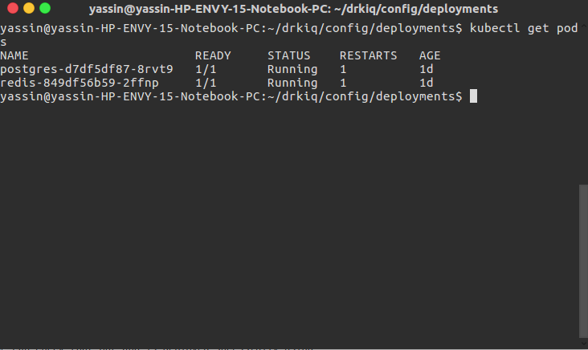

# DRKIQ Orchestration Task

The following ruby on rails app was containerized using docker, then further orchestrated using kubernetes.
The app was dockerized and further modified using the following guide https://semaphoreci.com/community/tutorials/dockerizing-a-ruby-on-rails-application. 
A container image was then built and pushed on my personal dockerhub repository, for further use later on.

## Orchestration
- Orchestration was performed using kubernetes.
### Tools
- [Minikube](https://github.com/kubernetes/minikube) was used to build a local cluster with one active node.
- [Kubectl](https://kubernetes.io/docs/reference/kubectl/overview), a kubernetes command-line-tool for managing and deploying applications.
- [Kompose](https://github.com/kubernetes/kompose) was used to build a basic skeleton for the kubernetes config files such as deployment and service files.
- [Kube-spwan](https://github.com/kinvolk/kube-spawn) was initially used to build a local multi-node cluster as it supports a loadbalancer service as opposed to minikube which currently has no support for such services. Kube-spwan was later removed from the project setup as it added unnecessary overhead with no clear optimization.

### Set-up
- A one node cluster was initially setup on the local host machine.
- All relevant deployment, service and volume config files needed by kubernetes are placed under their respective names in the folder config, i.e for deployments files the path is ./config/deployments/.. etc.
- The kubenetes config currently in place is under a loosely coupled and highly cohesive desgin, where each micro-service has its own deployment, service, persistent voulme and persistent volume claims file.

#### Deployments 
- There are four deployments files for each micro-service, drkiq-deployment for the ruby app, postgres-deployment for the db,   redis-deployment for the cache and finally sidekiq-deployment.
- Each deployment has only 1 replica.
- For the drkiq deployment I used the dockerized ruby on rails container image that I initially created.

#### Services
- There are 3 service files for the following deployments, drkiq, postgress and redis. 
- The drkiq serivce is of type "NodePort".

#### Volumes
- There four persistent volumes and four persistent volume claims, where each persistent volume claim binds to one specific persistent volume.
- Each micro-service has a corresponding persistent volume claim bound to a persistent volume.

### Running the setup
- Start the local cluster using
```
minikube start
```
- At this point we should have one active node, we could check this using
```
kubectl get nodes
```
- Once the cluster is up and running, we should start deploying our app. Yet, first we need to establish our persistent volume and bind them to claims. We can do that by running the following
```
kubectl create -f <name-of-volume-file>
```
- Once we created all persistent volumes and bound them to a claim, we can now finally start deploying our app onto pods.
```
kubectl create -f <name-of-deployment-file>
```
- We can check that our app is deployed successfully using
```
kubectl get pods
```
we should see something of this sort 


- We can then run of service files using
```
kubectl create -f <name-of-service-file>
```
- By running
```
kubectl create -f drkiq-service.yaml
```
we are essentially exposing the drkiq deployment

- use the external ip of the app, alongside the node and nodeport value to access and test that the app is up and running on a kubernetes cluster.

